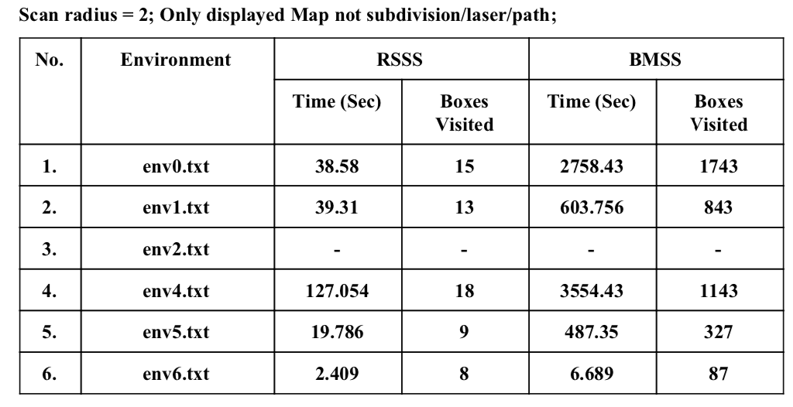
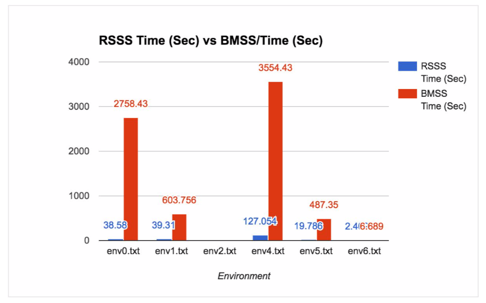

# Online-Pathfinding
A Team project to develop, design, implement and analyze two new path finding algorithms based on Soft Subdivision Search algorithm. Also implemented GUI to visually control environment and analyze algorithms. Algorithms were tested with a MATLAB disk robot simulation.

Get Started Quickly, read [How To Use.](#how-to-Use)
Learn more about our methods, results, analaysis and conclusions: read [Project Report](#introduction)

***Contributors: Shivam Swarnkar & Kamal S. Fuseini***

For a quick overview, look at our [presentation](https://github.com/shivamswarnkar/Online-Pathfinding/blob/master/Presentation.pdf).
For more details, read our [ project report](https://github.com/shivamswarnkar/Online-Pathfinding/blob/master/FinalProjectReport.pdf). 

### Abstract

In this project we aim to find different methods to solve Online Pathfinding problem. In this simulation, a disk robot is simulated in matlab to navigate an unknown environment while trying to reach a goal. There are two methods used to implement the navigation. The first is Repetitive Soft Subdivision Search (RSSS), where the robot runs a soft subdivision search algorithm on the map it is building each time it scans. The second is Bounded Modified Subdivision Search (BMSS), where the algorithm uses Subdivision Search approach with new classifier predicates. BMSS is supposed to be a modified and efficient solution for Online Pathfinding, which eliminates the repetitive computations done by RSSS.

### Main Files
- Final Report.pdf
- MainGUI.m   	{run this file to run the project}
- RSSS folder 	{contains files for RSSS algorithm}
- BMSS folder 	{contains files for BMSS algorithm}
- Common folder 	{contains common files used by RSSS & BMSS}

Info for use: 
 (See Final Report.pdf Apendix for more detailed informations)

Note : Explored map, time and box visited are updated after each iteration in algorithm. In some cases, if iteration involves a lot of computing, then you may see unchanged explored map, time and box visited values. In this condition, some buttons may not respond quick. If you face this condition then just wait for some time. 

### How to Use 
Run the MainGui.m file to run the project which will show the following GUI.

There are mainly four panels
	- Input Map (to show input map), 
	- Explored Map (to show so far explored map), 
	- Map Control ( to show/hide subdiv, path and laser), 
	- System control (to set input file, scan range and algorithm to run)
	- Observation Panel (to ovbserve the time, box visited and to pause/stop the running algorithm)
	- User can use toolbar tools to zoom in/out and move the Input and Explored maps.

### Environment files

#### Map Control
This panel lets user control the Explored Map. User can use this panel to see the subdivisions(Show Subdiv), a visual laser which is represented by a dashed circle around the disk robot(Show Laser Scan) and the path to the goal (Show Path). The Latency controls the speed of search (visible in Explored map). Slider allows user to slow down the each iterations, which can make observations and analysis easier. (This panel stays inactive until an input file is give)

#### System Control
Input File changes/sets Input Map window. User can preview the input map by writing the input filename and pressing “Enter” Key. Algorithm shows a pull down menu to select either RSSS of BMSS to be run. Scan Range takes in the radius of the Laser scan. Run begins executing the algorithm selected.

#### Observation Panel
Time (sec) is the elapsed time in seconds since the algorithm was ran. Box Visited is the number of subdivided boxes the robot has been to while trying to find a path. Pause places the running algorithm on hold. Stop exterminates the current path finding algorithm. (This panel stays inactive until an input file is give)

### Introduction
In Online Path Finding (OPF), an agent (the disk robot in our simulation) explores an unknown map to find a goal position. In this simulation, we aim to solve OPF by utilizing some components of Subdivision Search methods and Soft Subdivision Search algorithm.

In general, Subdivision Search involves spliting an environment into boxes and making a tree of these boxes. The whole environment dimensions is designated as the rootbox. Each time a split takes place, the new boxes are added to the tree as the children of the box on which the split took place. Each new box is classified based on the obstacles (features) in and around it as either free, stuck , mixed. Soft subdivision search algorithm uses this general subdivision approach with soft predicates to find a path consisting of free connected boxes. SSS subdivides the environment and uses a Union Find data structure to check the if start and goal points are connected through free boxes.

In our first method, RSSS, we use SSS to find a path from current position to goal position given current knowledge of obstacle sets. We then select a point on the calculated path using our constraints and heuristic.
Our second method, BMSS, uses a modified version of Subdivision Search to find the path.
In modified Subdivision Search, box classifications are bounded by the range of visibility. Any free box beyond the range of visibility is considered potentially free, and robot is only allowed to move to a free box.
In both methods, we use Greedy First heuristic to select boxes to explore the map. In general, Greedy First heuristic selects the best available choice. In our case, we select the box closest to the goal for exploration.

### Goals
Our goals were to implement algorithms to explore an unknown environment by scanning for obstacles and finding a path to a goal while building a map of the environment. We also aimed to generate random maps using Python and to create a user friendly GUI which could help users to observe algorithms’ performances

### Methods
We are using Matlab for robot and mapping simulation, Matlab is also used for the Graphical User Interface.

We implemented two methods to achieve our main goal. First method (RSSS) uses SSS where second method (BMSS) uses a modified version of Subdivision Search to solve the problem. Both implementations used Robot and Laser class to scan the environment and build the map.

Our Robot class has properties ‘laser’ of type Laser, a map of type Environment and position trees ( an array of positions where we performed scans). Environment class contains the goal position, the start position, the current position and the obstacles as an array of polygons represented by their vertices. It also contains showEnv method to display the environment.

We implement the laser with a class. The Laser class has member variables range, environment and polygons. The range will determine how far the scan can be from the circumference of the robot. The environment is the environment we have to explore. Polygons is a cell structure that contains each of the obstacles in the environment property as a structure of lines for each polygon obstacle. That is a polygon is a cell structure of Line types. A Line type has two endpoints as member variables. It also a type property to determine if the line is ‘vertical’ or ‘horizontal’. If it is a line with a slope and an intercept then its type is ‘normal’. Normal type lines then have their slope and intercept properties set appropriately. A line has a method that determines the intersections of that line with a circle whose radius and x,y-coordinates are given. If the line segment ends inside the circle the intersection would be calculated as the endpoint in the. This circle would be of radius the range of the laser plus the radius of the robot. The Laser class also has a scan method. This method takes in the position of the robot and using the range finds all the parts of the polygons it can see. Since polygons are made of lines, for each line we see if any part of the line intersects with the range of the scan. If only a part of the whole line is in the range then only that part is recorded as seen. We then returns the scanned. Below is a map created from one scan of an environment with scan radius of 2:

Each scan returns the seen part of the polygons as a cell array of lines. We then add these lines as obstacles into our map (in other words, add elements into polygons array of the Environment class). However it’s possible that two or more lines are connected or represent some overlapping areas, therefore we run a test on each pairs of lines to combine any overlapping areas as a single line.

In our first method, when we have an updated map containing information obtained in new scan, we set map’s starting point as robot’s current position (which is a member variable of Robot’s map property) and keep the original goal points. We then pass this new updated map to our SSS class which returns a path from robot’s current position to goal position in the currently explored map.

SSS and Subdivision class contain similar components from HW4 to use soft subdivision search to find a path from start to goal using Greedy Depth First heuristic. Our modified SSS is initialized with an Environment class object (instead of filename_. SSS uses the passes Environment class object to setup the Subdivision object and finds a path from the starting point (which is the current position of the robot) to the goal point. First it subdivides the map to find the robot’s initial footprint in a free box. Once it has a free box containing the robot, it adds all neighbours of the free box into a priority queue (which is used to keep all boxes to be explored, and always prioritizes the closest box to the goal). SSS selects the closest box from the queue, if the box is stuck then SSS neglects it, if the box is free then it adds it to its Union Find, else if box is mixed then it splits the box and adds its mixed children into the queue and then repeats the previous steps until goal and start free boxes are connected through free boxes or each possible box between goal and start has been splitted up to the minimum width (some epsilon). It then extracts a path using a greedy approach, and returns it to the RSSS class as an array of points.

RSSS class uses the returned path array from SSS to move the robot to the farthest point which does not go beyond the limit of scan. Each time it scans, it updates the map, runs the SSS again, move to the farthest point in range again and keeps repeating it until it reaches the goal.
In our second method, BMSS, we work with same Subdivision instead of creating new Subdivision for each iteration in RSSS. We define new predicates and box types so that we can control which box of the subdivision we are on and its neighboring/adjacent boxes.

In our Modified Subdivision, a box is classified “potentially free” if it’s classified as free based on current knowledge of obstacles. A box B is classified “free” if and only if it is “potentially free” and and all the vertices of B are visible and in the range (r -r0), where r is the range of the laser and r0 is the radius of the robot. A box is classified “stuck” if it’s classified as stuck based on current knowledge of obstacles and “mixed” if it’s mixed based on current knowledge. A box is relevant to our search, if one of its vertex is visible in the scanned area and it’s not classified as “stuck”. The basic method for BMSS is as follows:
 - Scan the environment, add new obstacles to the map
 - Subdivide the current map and find a free box containing robot start position
 - Add neighbours and adjacent relevant boxes (free and mixed) into the the queue
 - Select the best box from the queue using heuristic
 - If selected box free
 	- - Move to the box and scan
 	- - Add new obstacles to the map, merge overlapping obstacles and remove copies
 	- - Classify relevant boxes and add (free/mixed) nbrs to queue
- Else split the box, add the relevant (free/mixed) children to the queue and select a new box
- Keep selecting the boxes until selected free box contains goal or queue is empty

In BMSS, we also need to distribute new obstacles to leaf boxes. Once we get free merged and non-repeated obstacles, we add them to feature sets of the leaf boxes if they are within a range. Also, when we merge two obstacles, we change one of their values to empty array and when box try to access the empty array obstacles, we delete them from the box’s feature set.
To analyze both methods, we made a GUI to control and monitor their steps. We used Matlab GUIDE to design and build our GUI, and changed BMSS and RSSS classes to initialize with a GUI handle property so that we could control their processes by the user inputs in GUI. For example, both classes check GUI.showSubdiv value to display/not to display the Subdivision.

### Method 1 : RSSS
First we get the actual file, create an environment (shown in figure 1) which will be used by the Laser class to scan. We scan (shown in figure 2), send the scanned map to SSS class which subdivides the given map (shown in figure 3) and finds a path (using greedy algorithm, shown in figure 4) to the goal and returns the path as an array of points to RSS class (shown in figure 5 as small red circles). Robot moves to the best position in range (nearest to the goal, shown in figure 6) and repeats the previous steps until it reaches the goal (shown in figure 7).

### Method 2 : BMSS
Note : “potentially free” are shown by dark green, “free” are shown by light green, “stuck” are shown by “red” and “mixed” with yellow.
First we get the actual file, create an environment (shown in figure 1) which will be used by the Laser class to scan. We scan (shown in figure 2), updates the map and subdivide (with new predicates and box types) it until we get a “free” box containing our robot or the box gets too small to split (less than epsilon, shown in figure 8). We then add “relevant” neighbours to our priority queue, select the best one, if it’s “free” we move there and scan, add new “relevant” neighbours to queue(shown in figure 9). If we select a mixed or “potentially free” box, then we split. Keep repeating the process, until there no boxes in queue or we find goal.

### Results

### Observations, Analysis and Comparison

Following table shows the time taken and boxes visited by each algorithm. Please note that boxes visited by BMSS are very high because they also include the “mixed” and “potentially free” boxes which were explored in algorithm, but RSSS boxes only contains the boxes it visited after getting path from SSS. Therefore, a good measurement for comparison is time not number of boxes visited.

We also observed that BMSS was limited by laser scan range and epsilon. Since robot can only move scan radius - (robot radius + box radius), if scan range is small and algorithm requires to find smaller box than a box with width epsilon, then it won’t find path. Where RSSS didn’t have this limitation.

### Conclusions
The two methods work but even though we expected BMSS to be faster, for most of the test maps RSSS is faster. We believe it’s because BMSS bounds robot movements only to free boxes’ centers. In many cases, this bound restricts robot to exploit full advantage of scanned area. In general, free boxes are very small, hence robot takes very small steps with each iterations even if the robot can safely move to some part of a big potentially free box (within our range). On the other hand, RSSS allows robot to move beyond box’ center limit, and takes as big a step as possible. However, we believe that if we could modify BMSS to avoid movement
10
limitations, it would perform better than RSSS as it does not waste computation power, and uses less memory space.
We aim to combine BMSS and RSSS methods to implement an even more efficient and improved algorithm to solve OPF.

### References
● Yap, Chee K. "Soft Subdivision Search in Motion Planning." (n.d.): n. pag. Web. 15 Apr. 2017.

● Yap, Chee K. "Lecture 2 : Voronoi Diagrams and Path Planning a Disk Robot". 7 Feb 2-17. pag. Printed. 15 Apr. 2017.
